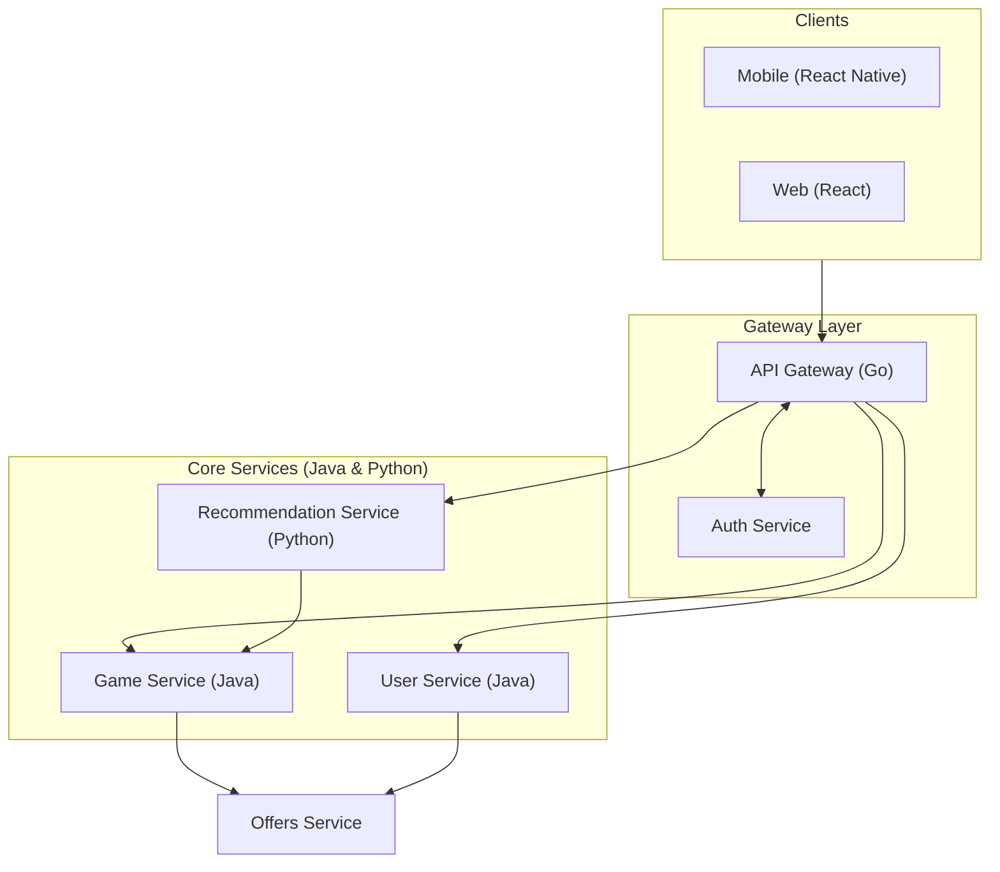
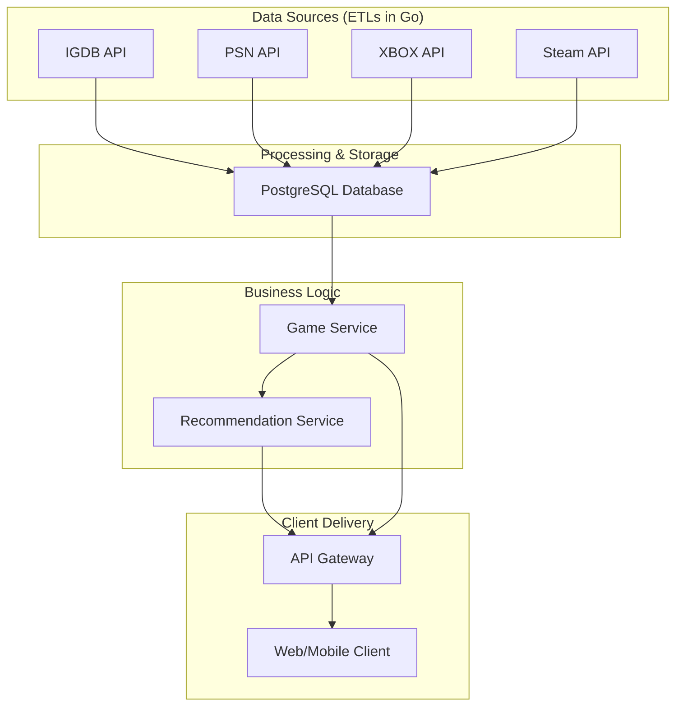

# Game Insight 🎮
Game Insight is a cross-platform game recommendation engine designed to answer the perennial gamer question: **"What should I play next?"**

It solves this by creating a **"True Gamer Profile"**—a single, unified view of a user's entire gaming life, aggregating library data, playtime, and achievements from multiple platforms like Steam, PlayStation, and Xbox. This rich, behavioral dataset powers a nuanced recommendation engine that goes far beyond simple genre matching.

-----

## Key Features

  - **Unified Game Library**: Connect multiple platform accounts to see your entire collection in one place.
  - **Hybrid Recommendation Engine**: A sophisticated model combining content-based and collaborative filtering to give you tailored suggestions.
  - **Deep Data Analysis**: Leverages nuanced metrics like **playtime** and **achievements** to understand your unique playstyle.
  - **Integrated Deal Tracking**: Get alerts when games on your wishlist go on sale across various storefronts.
  - **Cross-Platform Clients**: Access your profile and recommendations via a web app (React) and a mobile app (React Native).

-----

## System Architecture

The platform is built on a modern, scalable microservices architecture to ensure performance and separation of concerns.

### Technology Stack

  * **Frontend**: React (Web), React Native (Mobile)
  * **API Gateway & ETLs**: Go (Golang)
  * **Backend Core Services**: Java (Spring Boot)
  * **Recommendation Service**: Python (scikit-learn, TensorFlow)
  * **Database**: PostgreSQL
  * **Asynchronous Messaging**: RabbitMQ (for inter-service commands), Apache Kafka (for data ingestion pipelines)

### System Utilization Flow

This diagram illustrates how clients interact with the backend services through the API Gateway.



### Games Data Pipeline

This chart shows how gaming data is collected, processed, and served.



-----

## Project Roadmap

The project is being developed according to a strategic, phased roadmap.

  * **Phase 1: De-Risking & Foundation 🏛️**

      * **Goal**: Achieve legal and technical stability.
      * **Focus**: Build a functional MVP using only the official Steam API while proactively initiating formal partnership discussions with Sony and Microsoft for legitimate data access.

  * **Phase 2: Expansion & Growth 🚀**

      * **Goal**: Achieve product-market fit and scale the user base.
      * **Focus**: Integrate console data (upon securing partnerships), launch publicly with a freemium subscription model, and activate deal tracking features.

  * **Phase 3: Moat-Building & Scaling 🏰**

      * **Goal**: Create a defensible market position and activate long-term revenue streams.
      * **Focus**: Build social features to drive network effects and develop a B2B data insights product for publishers and developers.

-----

## Getting Started

To get a local copy up and running for development and testing, please follow these steps.

### Prerequisites

You'll need the following tools installed on your system:

  * Git
  * Docker and Docker Compose
  * Node.js (v18+)
  * Go (v1.20+)
  * Java (JDK 17+)
  * Python (v3.9+)

### Installation

1.  **Clone the repository:**
    ```sh
    git clone https://github.com/your-username/game-insight.git
    ```
2.  **Navigate to the project directory:**
    ```sh
    cd game-insight
    ```
3.  **Set up your environment variables.** Copy the example file and fill in your own API keys and configuration details.
    ```sh
    cp .env.example .env
    ```
4.  **Build and run all services using Docker Compose:**
    ```sh
    docker-compose up --build
    ```

-----

## Contributing

Contributions are what make the open-source community such an amazing place to learn, inspire, and create. Any contributions you make are **greatly appreciated**.

Please see the `CONTRIBUTING.md` file for our code of conduct and the process for submitting pull requests.

## License

Distributed under the MIT License. See `LICENSE` for more information.
