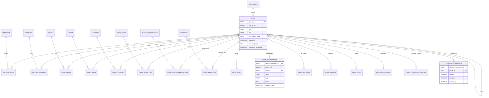

# Game Catalog ER Diagram

Title: Game Catalog ER Diagram (IGDB + Phase 2)  
Version: 0.1.0  
Last Updated: 2025-08-15  
Owner: Anderson (Sole Maintainer) <andersonfilho09@gmail.com>  
Status: Draft  
Decision: Provide high-level ER overview for core & phase 2 entities  

## Notes
- Relationship tables (GAME_GENRE etc.) omitted detailed columns for clarity.
- Achievement icons reused via MEDIA_ASSET (not separately drawn).
- Future entities (Version, Engine, Descriptor) excluded until Phase 3 promotion.

## Revision History
- v0.1.0 (2025-08-15): Initial ER diagram.

