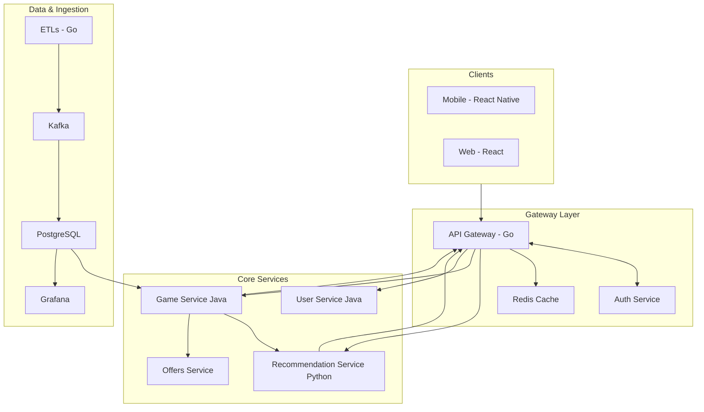
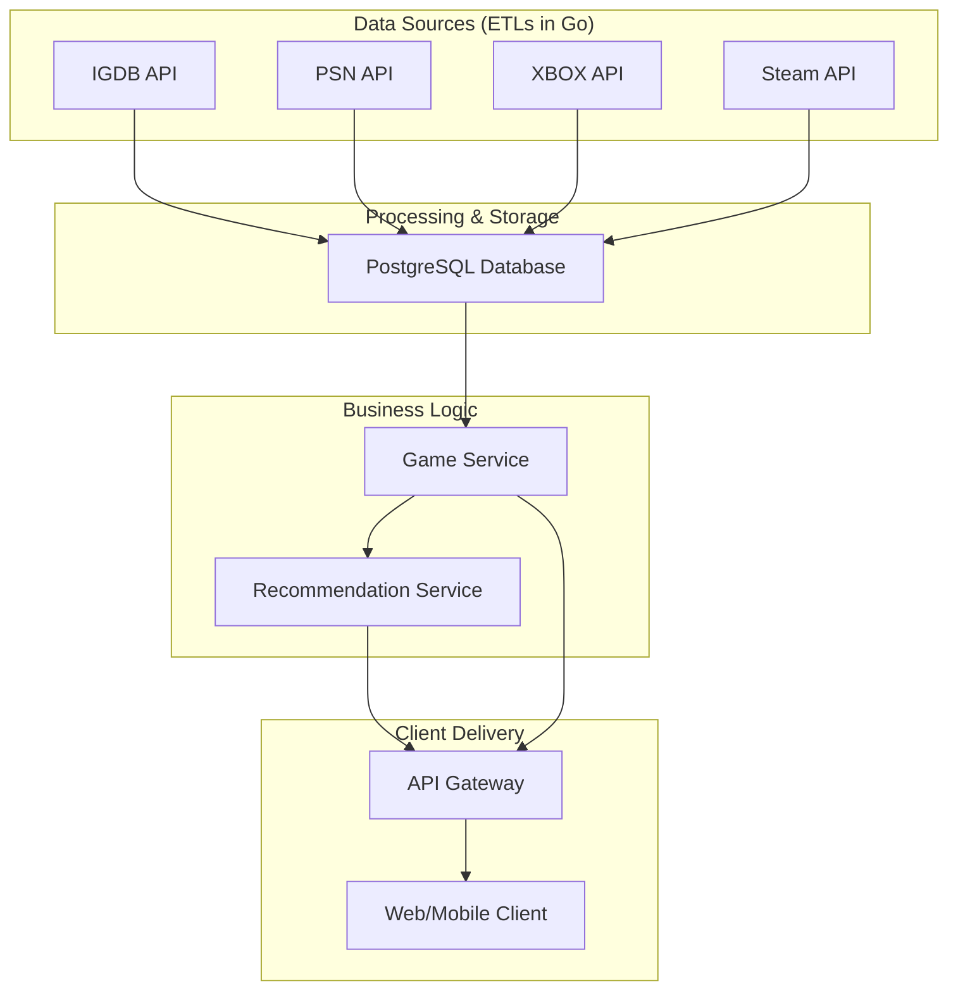

## Game Insight: A Strategic Analysis

Title: Game Insight: A Strategic Analysis  
Version: 0.1.0  
Last Updated: 2025-08-15  
Owner: Anderson (Sole Maintainer) <andersonfilho09@gmail.com>  
Status: Accepted  
Decision: Final  

This document outlines the proposed system architecture and provides a comprehensive strategic analysis for the Game Insight platform.

### **Proposed System Architecture**

The following diagrams represent the proposed technical structure for the platform.

#### **System Utilization Flow Chart**

This diagram illustrates the user interaction flow, from the client applications through the API Gateway to the various backend microservices.

#### **Games Data Pipeline**

This chart shows how gaming data is collected from various sources, processed, stored, and ultimately served to the user.

-----

### **I. Executive Summary: A Strategic Assessment**

Game Insight's core value — the "True Gamer Profile" — remains compelling. To de-risk and accelerate product-market fit, the platform will adopt a conservative launch strategy focused on official data sources (Steam + metadata + deal feeds) while pursuing commercial partnerships with Sony and Microsoft. Technical and operational investments will prioritize resilient ingestion, privacy-by-design, and a reproducible recommendation pipeline.

Immediate objective (next 0–4 months): Build a Steam-only MVP that proves recommendations powered by playtime + achievements, drives strong retention through deal-tracking, and validates the recommendation model for future cross-platform expansion.

Key change from prior plan: Remove any production reliance on unofficial PSN/Xbox APIs. Mark those integrations as "blocked" until signed agreements exist.

#### **Key Findings**

* **The Market Opportunity:** The erosion of platform exclusivity creates a significant market opportunity for a third-party meta-platform to serve as the central hub for a player's gaming life.
* **The Core Asset:** The platform's hybrid recommendation engine, which synthesizes a **"True Gamer Profile"** from cross-platform data, is its most significant potential competitive advantage.
* **The Critical Threat:** The platform's viability is predicated on sourcing user data. Reliance on **unofficial and non-commercially licensed APIs** for PlayStation and Xbox constitutes an existential business and legal risk.
* **The Strategic Imperative:** Success requires both technical excellence and a proactive strategy to mitigate profound data-sourcing risks by building a robust legal and partnership framework.

#### **Top-Line Recommendations**

1.  **Phase 1 - De-Risk and Validate:** Focus on an MVP using only the official Steam Web API. Simultaneously, initiate formal partnership discussions with Sony and Microsoft to secure legitimate data access.
2.  **Phase 2 - Expand and Acquire:** Upon securing legitimate access, integrate PlayStation and Xbox data. Launch publicly with a user acquisition strategy centered on integrated deal-tracking and a freemium model.
3.  **Phase 3 - Scale and Defend:** Build a defensible moat with community and social features to drive network effects. Develop a B2B data insights product as a long-term, high-margin revenue stream.

-----

### **II. The Unified Gamer Profile: Validating the Core Value Proposition**

The modern player's library is frequently distributed across multiple platforms. This industry-wide blurring of boundaries directly validates the core problem Game Insight aims to solve. A unified view of a user's entire gaming history is no longer a niche desire but an emerging necessity for meaningful game discovery.

#### **Beyond Genre: The Demand for Nuanced Recommendations**

The true opportunity lies in leveraging deeper, more nuanced data. Academic research confirms that cumulative **playtime** is an "incontrovertible testament" to user engagement and a far more reliable indicator of preference than explicit ratings.

#### **Initial Market Positioning and Unique Selling Proposition (USP)**

Game Insight's USP is the creation of the **"True Gamer Profile"**: a single, comprehensive view of a user's entire gaming life. A crucial component of this USP is the integration of **deal tracking**. This feature is a critical **Trojan horse for user acquisition**, transforming the service from a passive discovery tool into an active, money-saving utility. It provides a tangible and compelling reason for users to link their accounts.

-----

### **III. The Recommendation Engine: From Data Points to Player Delight**

The engine will use a sophisticated, hybrid model to deliver superior recommendations.

#### **Architecting a Hybrid Recommendation Model**

* **Content-Based Filtering:** Analyzes game properties (genre, developer, tags) to recommend similar items. This is essential for addressing the "cold start" problem for new users and new games.
* **Collaborative Filtering:** Operates on the principle that users who agreed in the past will agree in the future. By analyzing the user-item interaction matrix (who played what, for how long), it can identify players with similar "fingerprints" and recommend games that "people like you" enjoyed.

#### **Leveraging Nuanced Data**

* **Playtime as the Ground Truth:** Playtime is the most powerful implicit signal of preference. The engine must treat it as the primary metric for a user's affinity for a game.
* **Achievements as Behavioral Fingerprints:** Achievements provide granular insight into *how* a user plays (e.g., stealth vs. aggression), allowing for recommendations that cater to a specific playstyle.

#### **The "Cold Start" Problem and Advanced Solutions**

* **Solution 1: The Crit-Rate Model - Personality Onboarding:** An onboarding quiz posing nuanced psychographic questions can sort users into initial "player archetypes," providing an immediate, rich baseline profile for recommendations before any accounts are linked.
* **Solution 2: LLM-Powered Profile Generation:** A future enhancement could use Large Language Models (LLMs) to synthesize a user's interaction history into a flexible, narrative profile that captures subtle preferences.

-----

### **IV. Technical Architecture & Scalability Analysis**

The proposed polyglot microservices architecture is modern, scalable, and well-aligned with the platform's needs.

#### **A Polyglot Backend Strategy**

* **Go (Golang):** Ideal for the **API Gateway and ETLs** due to its high performance, low memory footprint, and excellent concurrency model.
* **Java (Spring Boot):** The superior choice for the core business logic services (**User Service, Game Service**) due to its robust ecosystem and rapid development capabilities.
* **Python:** The de facto standard for the **Recommendation Service**, providing a vast ecosystem of machine learning libraries (scikit-learn, TensorFlow, etc.).

#### **The Messaging Backbone: RabbitMQ and Kafka**

* **RabbitMQ:** Correctly designated for asynchronous **inter-service commands** (e.g., "re-calculate user profile"), where complex routing and guaranteed delivery are key.
* **Apache Kafka:** Correctly designated as the backbone for the **ETL data ingestion pipeline**, designed for handling massive volumes of event data at high throughput.

#### **Technology Stack Decision Framework**

| Category  | Technology         | Raw Performance | Memory Footprint | Developer Ecosystem | Ease of Learning | Operational Complexity | Fit for API Gateway/ETLs | Fit for Core Business Logic | Fit for Recommendation Service |
| :-------- | :----------------- | :-------------: | :--------------: | :----------------: | :--------------: | :--------------------: | :----------------------: | :-------------------------: | :----------------------------: |
| **Backend** | Go (Golang)        | 5               | 5                | 3                  | 4                | 3                      | 5 (Excellent)            | 3 (Good)                    | 2 (Fair)                       |
|           | Java (Spring Boot) | 4               | 2                | 5                  | 3                | 4                      | 3 (Good)                 | 5 (Excellent)               | 3 (Good)                       |
|           | Python             | 3               | 4                | 5                  | 5                | 3                      | 3 (Good)                 | 3 (Good)                    | 5 (Excellent)                  |
| **Messaging** | RabbitMQ           | 4               | 4                | 5                  | 4                | 3                      | 3 (Task Queues)          | 5 (Inter-Service Commands)  | 4 (Task Queues)                |
|           | Apache Kafka       | 5               | 3                | 5                  | 2                | 5                      | 5 (Data Ingestion)       | 3 (Event Sourcing)          | 4 (Data Ingestion)             |

*(Scoring: 1 = Poor, 5 = Excellent)*

-----

### **V. Competitive Landscape**

Game Insight enters a fragmented market with no single direct competitor but several adjacent players.

* **Platform Incumbents (Steam, PlayStation, Xbox):** Offer siloed recommendation engines that are blind to a user's activity outside their own ecosystem.
* **New Wave Curators (Crit-Rate):** Use personality quizzes for curation. **Strength:** Solves the cold-start problem elegantly. **Weakness:** Relies on self-reported data, which is less accurate than behavioral data like playtime.
* **Library Aggregators (Playnite, GameTrack):** Excel at library management and collection tracking, but recommendation is a secondary feature, not the core value proposition.

#### **Strategic Differentiation**

Game Insight's defensible position lies at the intersection of these categories: combining the **comprehensive data aggregation** of Playnite with the **dedicated recommendation focus** of Crit-Rate, but powering it with the **deep, behavioral, cross-platform data analysis** that incumbents cannot match.

#### **Competitive Feature Matrix**

| Feature / Attribute | Game Insight (Proposed) | Steam Recommender | Crit-Rate | Playnite | GameTrack / GAMEYE |
| :--- | :--- | :--- | :--- | :--- | :--- |
| **Core Value Prop** | Unified Behavioral Recs | Platform-Native Recs | Personality Curation | Unified Library Mgmt | Collection Tracking |
| **Platform Integration** | Steam, PS, Xbox | Steam Only | Manual Entry | PC Stores, Emulators | Steam, PS, Xbox (Limited) |
| **Rec. Data Source** | Playtime, Achievements | Playtime | User Quizzes, Ratings | Metadata Only | Library, Achievements |
| **Cold Start Solution** | Yes (Quiz-based) | No | Yes (Core Feature) | N/A | No |
| **Deal Tracking** | Yes | No | No | No | No |
| **Social Features** | Planned | Limited | Yes (Houses, Boards) | No | Yes (Activity Feeds) |
| **Monetization** | Freemium/Subscription | Platform Sales | Free (TBD) | Free (Open Source) | Freemium/Subscription |
| **Primary Platform** | Web & Mobile | PC (Desktop Client) | Web | PC (Desktop App) | Mobile-First |

-----

### **VI. Pathways to Profitability: Monetization and Growth**

A multi-faceted approach combining a consumer subscription, affiliate partnerships, and a B2B data service offers the most resilient path to profitability.

#### **Viable Business Models**

* **The Freemium/Subscription Model:** This is the cornerstone.
    * **Free Tier:** Offers core library unification and basic recommendations to drive user acquisition.
    * **Premium Tier (Game Insight+):** A recurring subscription unlocks advanced features: deep-dive recommendations, personal gaming analytics, and real-time deal alerts.
* **The Affiliate Model:** A natural extension of deal-tracking. **Challenge:** Steam, the largest PC storefront, lacks a public cash-commission affiliate program, making this a supplementary, not primary, revenue stream.
* **Data Insights as a B2B Service:** The long-term, high-value opportunity. The unique, aggregated, and anonymized cross-platform dataset can be packaged into trend reports for sale to publishers, developers, and market research firms.

#### **Monetization Model Viability Analysis**

| Monetization Model | Revenue Potential | Implementation Complexity | Time to Revenue | User Experience Impact | Market Acceptance | Key Dependencies |
| :--- | :--- | :--- | :--- | :--- | :--- | :--- |
| **Freemium/Subscription** | High | Medium | Medium | Neutral to Positive | High | Compelling Premium Features |
| **Affiliate Marketing** | Medium | Low | Fast | Positive | High | Active Partner Programs |
| **B2B Data & Insights** | Very High | High | Slow | Neutral | Medium | Large, Anonymized User Base |

-----

### **VII. The Data Integration Gauntlet: The API Ecosystem**

The platform's success is entirely dependent on the reliability and accessibility of third-party APIs. This section reveals significant risks.

#### **Third-Party API Review**

* **IGDB API (Game Metadata):** **Low Risk.** Official API. Requires a commercial partnership, which is a clear, defined process.
* **Steam Web API (User Data):** **Medium Risk.** Official API. Terms are ambiguous regarding commercial use, and a rate limit of 100,000 calls/day could become a bottleneck.
* **PSN API (User Data):** **CRITICAL RISK.** The proposed source is an **unofficial, reverse-engineered API**. Using it violates Sony's terms of service. Sony can disable this private API at any moment without warning, breaking the service for all PlayStation users.
* **Xbox API (User Data):** **CRITICAL RISK.** The proposed source (OpenXBL) is an **unofficial, third-party service**. The risk profile is identical to that of the PSN API, posing an existential threat.
* **IsThereAnyDeal API (Offers):** **Low Risk.** Official API with clear terms permitting commercial use.

#### **Data Source API Compliance Summary**

| API Source | Official Status | Commercial Use Policy | Key Restrictions | Risk Level | Mitigation Strategy |
| :--- | :--- | :--- | :--- | :--- | :--- |
| **IGDB** | Official | Requires Partnership | Commercial license fee | **Low** | Budget for and secure commercial license. |
| **Steam Web API** | Official | Ambiguous | 100k calls/day rate limit | **Medium** | Adhere strictly to ToS; design for rate limit. |
| **PSN (via psn-api)** | Unofficial | Violation of ToS | Unstable; no guarantee | **Critical** | Cease proposed use. Initiate formal partnership talks with Sony. |
| **Xbox (via OpenXBL)** | Unofficial | Violation of ToS | Unstable; no guarantee | **Critical** | Cease proposed use. Initiate formal partnership talks with Microsoft. |
| **IsThereAnyDeal** | Official | Permitted | Attribution required | **Low** | Adhere strictly to ToS. |

-----

## Revision History
- v0.1.0 (2025-08-15): Initial version.
